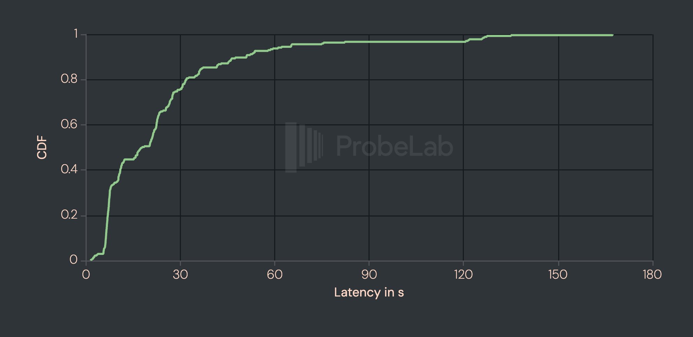
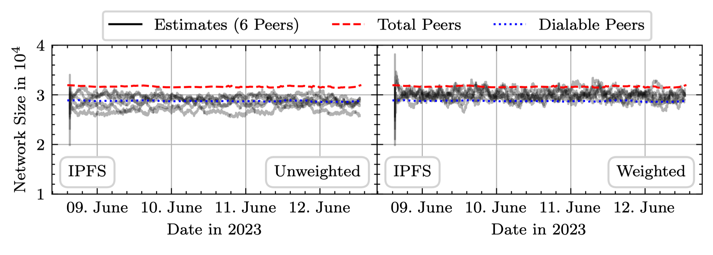
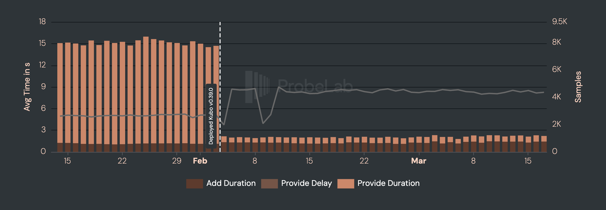
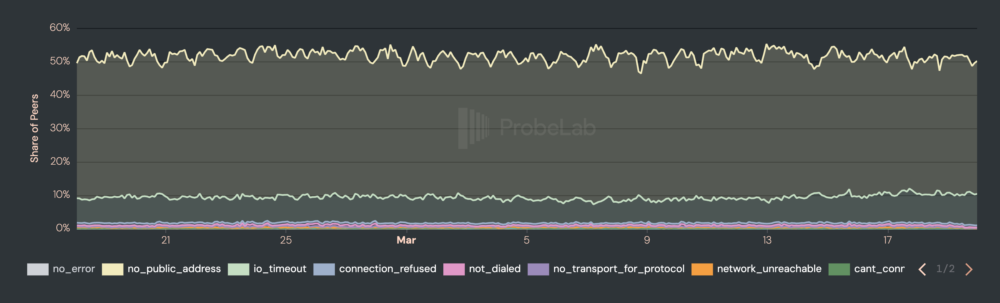
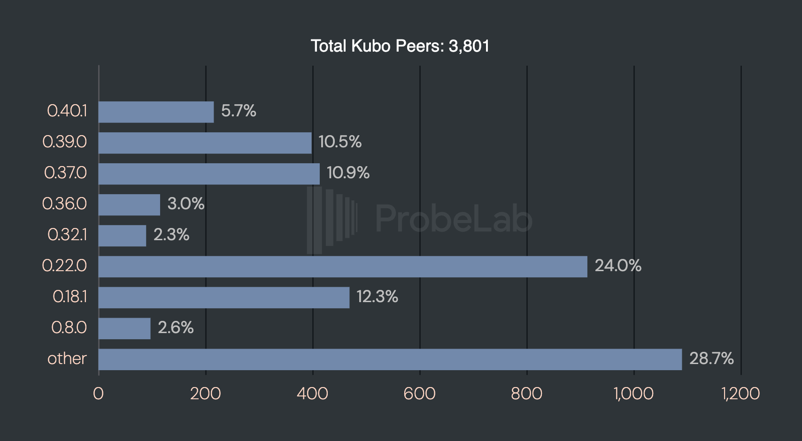

# Optimistic Provide: How We Made IPFS Content Publishing 10x Faster

_Cross-posted from [ProbeLab's blog](https://probelab.io/blog/optimistic-provide/)._

Publishing content in Distributed Hash Tables (DHTs) has traditionally been a slow operation, especially when: i) the network is large, and ii) the nodes participating in the network are churning frequently. The case is no different for IPFS’s Amino DHT, which meets both of these conditions. The ProbeLab team identified this problem years ago, through [extensive measurements](https://dl.acm.org/doi/abs/10.1145/3544216.3544232), and proposed an optimisation that was shown to improve performance, i.e., reduce the content publication time by over one order of magnitude while simultaneously reducing the network overhead by 40%.

The optimisation was named *Optimistic Provide* and it only recently shipped as a default in IPFS’s Kubo 0.39.0! The study was published in [IEEE INFOCOM 2024](https://ieeexplore.ieee.org/abstract/document/10621404), and we point readers to the publication for more but denser details.

In this blogpost we provide an overview of the technique proposed by our team, alongside basic technical details and, of course, results that prove the validity of our initial claims regarding its effectiveness.

> A big thanks to the [IPShipyard team](https://ipshipyard.com/) for their support along the way and the final push to get this feature into production. According to the results, it was worth the effort.

## TL;DR

The basic ideas behind Optimistic Provide are the following:

1. While *walking* the DHT, immediately store records with peers that are likely among the 20 network-wide closest peers.
2. Terminate the DHT walk immediately when the set of the discovered 20 closest peers likely constitute the network-wide closest peers.
3. Return control back to the user after most (not all) of the PUT RPCs have succeeded and continue with the remaining ones in the background.

Points 1. and 2. require knowledge of the total network size which we derive from a lightweight estimation method piggy-backing on the routing table refresh mechanism to not incur any additional networking overhead.

Optimistic Provide decreases significantly the _upload_ latency, from more than 13 seconds (often close to 20 seconds) to less than 1 second, and brings tremendous value and impact to the performance of IPFS.

What this means in practice: content publishers can now have their content published almost in real-time, i.e., ~1 second after content has been pushed to the network. This is a major improvement, compared to > 10 seconds before, as developers, users and application providers can re-iterate and debug in real-time.

## Traditional Provide Operation

To understand how these optimizations work, we must first look at the traditional "provide" operation. In a Kademlia-based Distributed Hash Table (DHT), such as the [Amino network](https://blog.ipfs.tech/2023-09-amino-refactoring/) used by IPFS, storing a record requires identifying the *k* peers closest to that data's identifier where [*k* is set to 20 in the Amino DHT](https://github.com/libp2p/specs/blob/6b6203ee6f62938ce67efdb33498173f475851c0/kad-dht/README.md). In this context, "closeness" is not defined by geographical proximity but by the XOR distance metric. This metric calculates the distance between a peer’s unique PeerID and the data’s Content Identifier (CID) by performing a bitwise XOR operation on their IDs.

Starting from a hard-coded set of bootstrap peers, a node fills its local routing table. The process of finding these 20 closest peers is known as a **DHT Walk**. It is an iterative search where a node queries its local routing table for the closest known peers and asks them for even closer candidates. This cycle continues until the initiator has received successful responses from the three closest peers it has discovered. Once the walk terminates, the **Follow-Up phase** begins: the initiator pushes the provider record to all 20 of those closest peers to ensure data availability even if some nodes leave the network.

So the takeaway is: a provide process consists of two phases

1. **DHT Walk** Finding the network-wide 20 closest peers
2. **Follow-Up** Pushing the record to these 20 peers

## **Performance Bottleneck**

While this system is robust, it is historically slow, often taking dozens of seconds or even minutes to complete. Our research at ProbeLab identified that the primary delay is the termination condition of the DHT walk.

The "traditional" algorithm is rigid: during the DHT Walk phase it insists on waiting for responses from the three discovered closest peers. In a permissionless network where peers frequently churn, these specific peers are often unreachable. The system then "backtracks," querying more distant peers to fill the gap, while the actual 20 closest peers might have already been discovered.

The graph below shows the cumulative distribution function of the total duration of provide operations from Europe, the traditionally fastest region. The original graph can be found [here](https://probelab.io/ipfs/dht/#chart-ipfs-dht-publish-performance-cdf). The graph shows that the median latency is around ~20s and that in the worst cases a single provide operation can take over two minutes.

This performance characteristic is prohibitive for delay-sensitive applications and this is what we attempted to address with Optimistic Provide.

## Optimistic Provide

**Optimistic Provide** addresses slow provide operations by replacing rigid waiting with statistical heuristics. Since **Kubo v0.39.0**, this is the default behavior, enabling sub-second record storage through three key mechanisms:

1. **Network Size Estimation:** Individual nodes now locally estimate the global network size using a lightweight, bias-corrected proximity model.
2. **Predictive Termination:** During the DHT Walk the initiator uses the network size estimate to calculate the probability that individual peers and its current set of closest peers are "close enough". Once it is 90% certain it has discovered a peer among the network-wide 20 closest peers, it stores the record immediately. Once it is 90% certain it found the target set, it terminates the walk immediately.
3. **Early Return:** In the follow-up phase, the system returns control to the user as soon as a subset (e.g., 15) of the 20 peers confirm storage. The remaining 5 requests continue asynchronously in the background, ensuring the record is fully replicated, without making the user wait.

### Network Size Estimation

One seemingly intuitive solution to derive a network size estimation might involve crawling the entire network to derive a number of participating peers. Yet, this approach proves impractical due to the excessive overhead it introduces. Distributing the task to a subset of peers that share the information would require trust in their honesty, which is a challenging proposition in a permissionless network.

Instead, we designed a lightweight estimation algorithm that piggybacks on data the node is already collecting meaning we incur zero additional networking overhead: the routing table refresh. During a refresh, a node looks up a random key for each of the buckets it maintains, where in Kubo's case, this means 16 lookups, plus the node's own ID. Each lookup returns the network-wide closest peers to a random target key, so a single refresh round naturally yields a sample of peer distances spanning the keyspace at different scales.

The core insight is that, assuming peer IDs are uniformly distributed, the distances of the 20 nearest peers to any given key follow a predictable statistical distribution, specifically, [Beta distributions](https://en.wikipedia.org/wiki/Beta_distribution) for [Order Statistics](https://en.wikipedia.org/wiki/Order_statistic) ([see this excellent blog post](https://eli.sohl.com/2020/06/05/dht-size-estimation.html)). This lets us treat each peer in a lookup result as an independent network size estimate. A single lookup returning 20 peers therefore yields 20 estimates rather than one if we only considered the keyspace density, and averaging across a handful of lookups produces a result that holds up well against ground-truth counts from our [Nebula crawler](https://github.com/dennis-tra/nebula).

There is one complication: querying within your own keyspace neighborhood, as the routing table refresh mechanism does, introduces a density bias. A peer sitting in a dense keyspace region will overestimate the global network size; one in a sparse region will underestimate it. Our bias correction addresses this by exponentially downweighting data points from non-full buckets. The intuition is that a full bucket indicates the covered keyspace region is well-populated enough to be representative, while a sparse bucket suggests a skewed local view. This correction won't be perfect in every case, but it substantially reduces variance in the estimates across peers.

The graph below shows unweighted versus weighted network size estimates from six independent peers in the IPFS Amino network over three consecutive days, overlaid with the total and dialable peer counts from our Nebula crawler.

For a more detailed discussion of the method we point interested readers [at our paper](https://ieeexplore.ieee.org/abstract/document/10621404).

### **Predictive Termination**

With a reliable network size estimate in hand, we can now make probabilistic decisions during the DHT walk rather than waiting for the rigid confirmation the traditional algorithm requires.

This happens at two levels. The first is per-peer: each time the initiator encounters a new peer during the walk, it checks whether that peer is already close enough to the target key to be among the network-wide 20 closest. Inverting the corresponding CDF of the order statistics Beta distribution lets us calculate a distance threshold which, if a peer falls within it, we can be 90% confident it belongs to the final target set. When that condition is met, we don't wait but instead store the record with that peer immediately.

The second level operates on the set of 20 currently known closest peers as a whole. After each query response, the initiator checks whether this set is likely already the global closest 20. We observe that the expected average distance of the 20 closest peers to a target key equals the expected distance of the hypothetical 10.5th-closest peer, which gives us a clean scalar to threshold against. Once the average distance of the known set falls below that threshold, again at 90% confidence, the walk terminates without waiting for the three closest peers to confirm, as the classic algorithm would require.

> Together, these two conditions eliminate the bulk of the waiting that makes classic provide operations slow. Unreachable peers, which previously caused the walk to backtrack and probe progressively more distant nodes, no longer hold up the process.

### **Early Return**

Predictive termination solves the DHT walk bottleneck, but it introduces a new problem in the follow-up phase. By skipping the classic algorithm's backtracking behavior, we lose the filtering effect it had on unreachable peers and those peers now surface during record storage instead. In practice, at least one of the 20 follow-up requests fails in the vast majority of operations, and a single unresponsive peer can stall the entire phase waiting for a timeout.

The fix is straightforward: rather than waiting for all 20 peers to confirm storage, we return control to the user as soon as 15 have responded. The remaining 5 requests continue asynchronously in the background and are never cancelled. Full replication still happens, just out of view. We chose 15 [based on prior work](https://github.com/probe-lab/network-measurements/blob/main/results/rfm17-provider-record-liveness.md#5-conclusion) showing that reducing the replication factor from 20 to 15 has a negligible impact on record availability in the IPFS network, so handing back control at that point carries no meaningful reliability cost.

## Results

ProbeLab has been monitoring the IPFS Kubo "Upload" performance [among many other metrics](https://probelab.io/ipfs) for a long time through our [extensive tooling](https://probelab.io/tools). We have updated our Kubo version to v0.39.0 in the beginning of February. The following plot shows the sharp drop of the upload latency from an average of ~15s to ~0.7s  right after the deployment of Kubo that includes Optimistic Provide.

### Record Availability

A natural concern with any optimization that short-circuits the classic algorithm is whether it compromises record availability. Storing records with the wrong peers, or too few of them, could make content harder to find. Our measurements show this is not the case. The peers selected by the optimistic approach are statistically close enough to the target key that retrievability remains intact, with GET error rates comparable to the classic baseline. The approach does result in slightly fewer successful storage confirmations per PUT on average, but this is an acceptable trade-off: our early return threshold was chosen precisely because [our prior work](https://github.com/probe-lab/network-measurements/blob/main/results/rfm17-provider-record-liveness.md) established that modest reductions in replication have negligible impact on availability in the IPFS network.

This is further reinforced by Kubo's [reprovide sweep](https://ipshipyard.com/blog/2025-dht-provide-sweep/), which subsequently performs a precise PUT operation to ensure records are stored with the most accurate set of peers. The initial optimistic provide trades some placement precision for speed; the reprovide sweep quietly corrects for that in the background.

### Limitations

The entire optimization rests on a reliable network size estimate. If that estimate is significantly off, the distance thresholds used for peer selection and walk termination will be miscalibrated, and record storage accuracy suffers.

One growing challenge here is the rise of undialable peers in the IPFS Amino DHT. As the graph below shows, roughly 50% of peer identities currently found in the network advertise only private IP addresses and cannot be reached from the public internet. In the current implementation these peers still feed into the network size estimation, inflating the count. This causes an overestimation, which makes the termination threshold more conservative rather than more aggressive. The failure mode is reduced performance rather than broken availability, but it does mean the optimization cannot fully reach its potential.

A second limitation is the cold start problem: a Kubo node needs to complete at least a partial routing table refresh before it has enough data to run the estimation, which can take anywhere from a few seconds to a few minutes after startup.

We propose three incremental improvements:

1. peers advertising only private IP addresses will be filtered out of the estimation when the node is operating on the public network. 
2. the reprovide sweep, which enumerates the network anyway, will feed an accurate peer count directly back to the optimistic provide algorithm, giving it a high-quality estimate without any additional overhead. 
3. the latest network size estimate will be persisted to disk so that on restart, the node can use the last known value immediately rather than waiting for fresh routing table data to accumulate assuming the network hasn’t grown or shrunk significantly since the last run.

## Summary

We believe that Optimistic Provide together with [Reprovide Sweep](https://ipshipyard.com/blog/2025-dht-provide-sweep/) fundamentally redefine the experience of publishing content on IPFS. Optimistic Provide delivers the initial fast store, making content immediately discoverable through HTTP Gateways and other Kubo nodes within a second. The Reprovide Sweep then follows up quietly in the background, ensuring all records are accurately placed in the network without placing excessive load on the node.

This is a stark contrast to the pre-0.39.0 world, where record availability could lag up to two minutes after adding content to a local Kubo deployment and where nodes with even a modest number of CIDs could fail to provide all of them within the 24-hour reprovide window entirely.

Beyond the immediate user experience improvement, Optimistic Provide addresses one of IPFS's most longstanding performance bottlenecks in a way that is backwards compatible with the existing network and generalizes to any Kademlia DHT deployment. It achieves a speed-up of over one order of magnitude, enables sub-second PUT operations for 90% of requests from North America and Europe, and does so while maintaining record availability and reducing networking overhead by over 40%. For a protocol that has long been held back from delay-intolerant use cases, this closes a significant gap.

## What’s next?

The most immediate action is straightforward: if you are running a Kubo deployment, update to v0.39.0 or later. As the snapshot below shows, only around [17% of publicly reachable Kubo nodes](https://probelab.io/ipfs/topology/#chart-agent-versions-avg) are currently running a version with Optimistic Provide enabled by default — meaning the majority of the network is still paying the full cost of the classic PUT operation (snapshot from 2026-03-20).

On the development side, we advocate for the work on three incremental improvements outlined in the limitations section: peer filtering, deeper Reprovide Sweep integration, and cached network size estimation on disk. Together they should allow the algorithm to reach its full potential even under adverse network conditions and immediately after node restarts.

Looking further ahead, there are a number of open questions worth investigating. The behavior of Optimistic Provide under severe network conditions like high churn, network partitioning, or Sybil attacks has not yet been characterized. We also see opportunity in exploring whether the same statistical framework could be applied to accelerate GET operations in cases where the DHT walk dominates retrieval latency like in IPNS lookups. Finally, since the technique is not specific to IPFS, we encourage maintainers of other Kademlia-based DHT deployments to evaluate whether Optimistic Provide could bring similar gains to their networks.

If you are working on IPFS tooling or infrastructure and want to contribute, the implementation lives in the [go-libp2p-kad-dht](https://github.com/libp2p/go-libp2p-kad-dht) repository. Feedback from real-world deployments, particularly in underrepresented regions or under unusual network topologies, is especially valuable.

## References

- Github repository with initial idea and code: [https://github.com/dennis-tra/optimistic-provide](https://github.com/dennis-tra/optimistic-provide)
- libp2p Github repository discussion: [https://github.com/libp2p/notes/issues/25](https://github.com/libp2p/notes/issues/25)
- IEEE INFOCOM 2024 paper: [https://www.fiz-karlsruhe.de/sites/default/files/FIZ/Dokumente/Forschung/Mathematik/INFOCOM24-IPFS.pdf](https://www.fiz-karlsruhe.de/sites/default/files/FIZ/Dokumente/Forschung/Mathematik/INFOCOM24-IPFS.pdf)
- IPFS Kubo v0.39.0 Release Notes: https://github.com/ipfs/kubo/releases/tag/v0.39.0
- Introduction of the Amino DHT: [https://blog.ipfs.tech/2023-09-amino-refactoring/](https://blog.ipfs.tech/2023-09-amino-refactoring/)
- libp2p Kademlia Spec: [https://github.com/libp2p/specs/blob/master/kad-dht/README.md](https://github.com/libp2p/specs/blob/master/kad-dht/README.md)
- Provider record liveness study: [https://github.com/probe-lab/network-measurements/blob/main/results/rfm17-provider-record-liveness.md](https://github.com/probe-lab/network-measurements/blob/main/results/rfm17-provider-record-liveness.md#5-conclusion)
